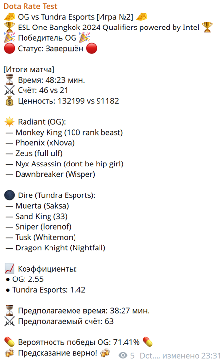
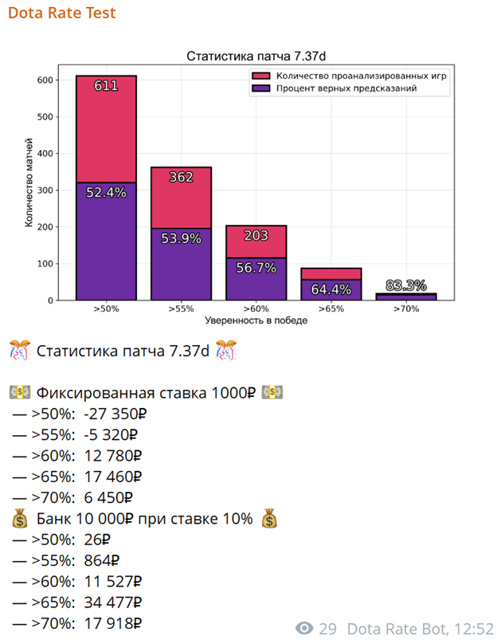
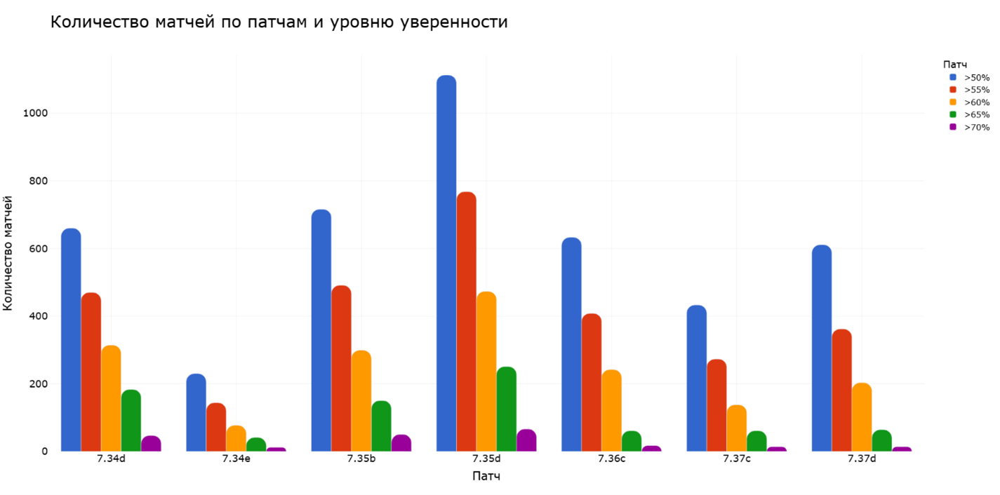
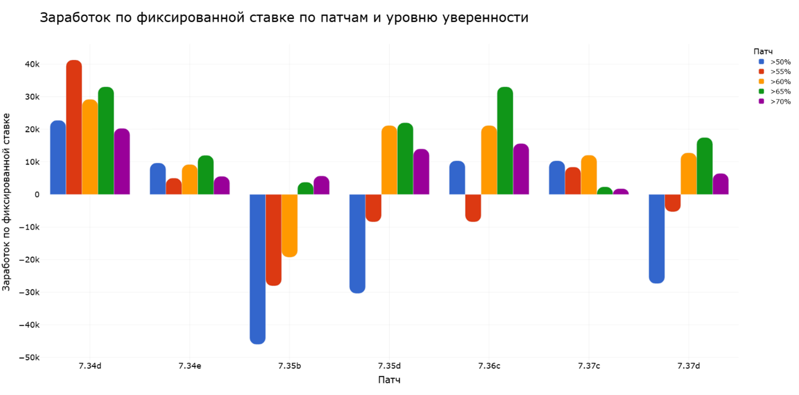
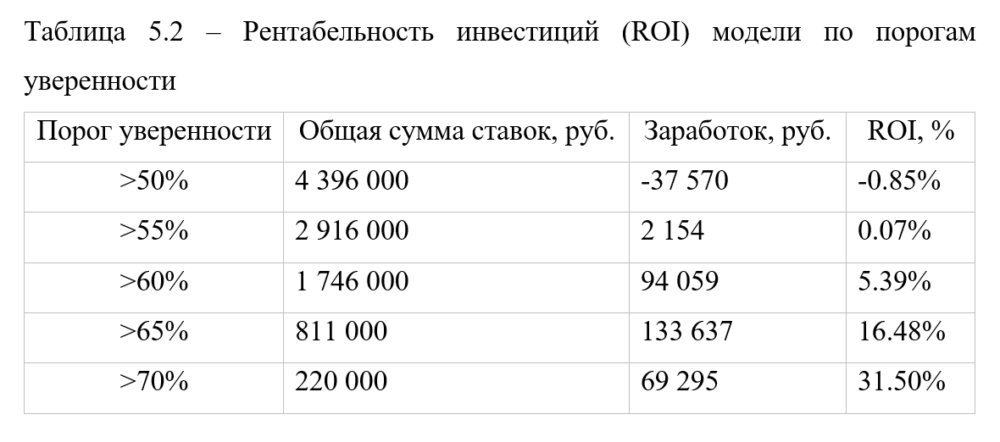

# Dota Rate

> ⚠️ **Work in Progress**: Это публичная версия системы, которая находится в процессе переработки архитектуры. 
>
> Оригинальная система успешно отработала больше года, но была написана как прототип и использовалась для защиты диссертации. Текущая версия переписывается с нуля с применением принципов чистой архитектуры, ООП и современных практик разработки.

## О проекте

Dota Rate - это система машинного обучения для прогнозирования исходов профессиональных матчей Dota 2. Проект объединяет сбор данных из множественных источников, обработку с помощью нейронных сетей и предоставление прогнозов через пользовательский интерфейс.

## Почему рефакторинг?

Оригинальная версия была написана как исследовательский прототип - десятки тысяч строк кода без четкой структуры, с дублированием логики и смешением ответственностей. Система работала и показывала результаты, но код не соответствовал моим личным стандартам для публичного репозитория.

Цели рефакторинга:
- Разделение на модули с четкими границами ответственности
- Применение ООП и SOLID принципов
- Упрощение поддержки и расширения функциональности
- Подготовка документации и тестов
- Создание кодовой базы, которую не стыдно показать

## Достижения оригинальной системы

Система тестировалась в реальных условиях с **6 октября 2023** по **20 ноября 2024** на профессиональных матчах:

- **Выборка**: проанализировано 4,396 профессиональных матчей в режиме реального времени
- **Точность**: до 70.9% на высокоуверенных прогнозах
- **ROI**: до 31.50% на высокоуверенных прогнозах
- **Покрытие**: 7 игровых патчей Dota 2 (7.34d - 7.37d)

## Демонстрация работы оригинальной системы

---
> 💡 **Справка: Пороги уверенности**
> 
> Модель на выходном слое генерирует значение от 0 до 1, представляющее вероятность победы:
> - **0.0** - 100% уверенность в победе Dire
> - **0.5** - равные шансы (50/50)
> - **1.0** - 100% уверенность в победе Radiant
> 
> Для удобства эти значения переводятся в проценты.
> 
> Чем дальше значение от 0.5 в любую сторону, тем выше уверенность модели. Пороги уверенности используются для фильтрации прогнозов на 5 категорий:
> - **>50%**: все матчи (любое отклонение от 0.5)
> - **>55%**: модель уверена минимум на 55% (значение <0.45 или >0.55)
> - **>60%**: средняя уверенность (значение <0.40 или >0.60)
> - **>65%**: высокая уверенность (значение <0.35 или >0.65)
> - **>70%**: очень высокая уверенность (значение <0.30 или >0.70)
>
> В хорошо откалиброванной модели точность предсказаний должна соответствует порогу уверенности. Чем выше выходное значение, тем выше должна быть точность. Например, при пороге >60% модель должна быть права хотя бы в 60% случаев.
---

### Информация о матче

  

Пример сообщения от Telegram бота с прогнозом на матч.

---

*Отображает составы команд, коэффициенты букмекеров, вероятность победы.*

*Данные о времени, счёте, ценности и результате матча/прогноза обновляются в реальном времени.*

### Статистика и аналитика

  

Пример сводки за игровой патч

---

*График показывает количество проанализированных матчей и точность по порогам уверенности. Ниже - результаты симуляции ставок с фиксированной суммой (1000₽) и процентом от банка (10% от 10,000₽).*

*Не смотря на небольшую выборку, видно как растёт точность при увеличении порога уверенности: от 52.4% на >50% до 83.3% на >70%.*

### Агрегированные результаты за период эксплуатации

  

Общее количество матчей

---

*Распределение 4,396 проанализированных в реальном времени матчей по семи игровым патчам (7.34d - 7.37d) и пяти порогам уверенности.*

*Наибольшая активность была в патче 7.35d, наименьшая - в 7.34e.*

 

  

Симуляция ставок

---

*Финансовая эффективность при фиксированной ставке 1000₽ по патчам и порогам уверенности.*

*График демонстрирует, что высокие пороги (>60%, >65%, >70%) стабильно прибыльны, в то время как низкие пороги (<55%) часто убыточны из-за недостаточной точности.*

 

  

Return on Investment

---

*Итоговая таблица ROI за весь период тестирования.*

*Ключевые выводы: порог уверенности >50% убыточен (-0.85%), >55% едва безубыточен (0.07%), но начиная с >60% система стабильно прибыльна (5.39%). Пороги >65% (16.48%) и >70% (31.50%) демонстрируют выдающуюся рентабельность, хотя количество подходящих матчей существенно меньше (811 и 220 соответственно против 4,396 на >50%).*

## Архитектура системы

Система состоит из трёх основных модулей, которые взаимодействуют для обеспечения полного цикла прогнозирования.

### Модуль ML

Отвечает за формирование датасета и обучение моделей:
- Агрегирует информацию о матчах из множественных внешних источников
- Формирует и валидирует датасеты для обучения
- Выполняет фильтрацию, предобработку и нормализацию данных
- Обучает модели на исторических данных
- Проводит валидацию моделей
- Генерирует прогнозы через готовые модели

### Backend

Обеспечивает мониторинг матчей и управление данными:
- Отслеживает проф. live-матчи через интеграцию с внешними API
- Парсит коэффициенты букмекеров
- Запрашивает прогнозы у ML модуля для активных матчей
- Сохраняет информацию о матчах, командах и результатах в БД
- Обновляет статусы матчей и финальные результаты в БД
- Предоставляет данные для клиентского интерфейса через API

### Telegram Bot

Предоставляет пользовательский интерфейс для взаимодействия с системой:
- Формирует и публикует сообщения о live-матчах с прогнозом
- Обновляет сообщения по мере изменения данных матча в реальном времени
- Публикует статистику с визуализации результатов (графики, статистика)

## Disclaimer

Проект разрабатывается в образовательных и исследовательских целях. Автор не несет ответственности за использование системы в коммерческих целях или для азартных игр. Все прогнозы являются вероятностными оценками и не гарантируют определенного результата.

## Контакты

**Автор**: [Sogato](https://github.com/Sogato)   
**Репозиторий**: [github.com/Sogato/DotaRate.git](https://github.com/Sogato/DotaRate.git)  

---

*Последнее обновление: февраль 2026*